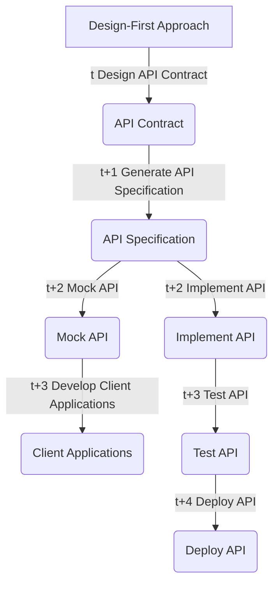
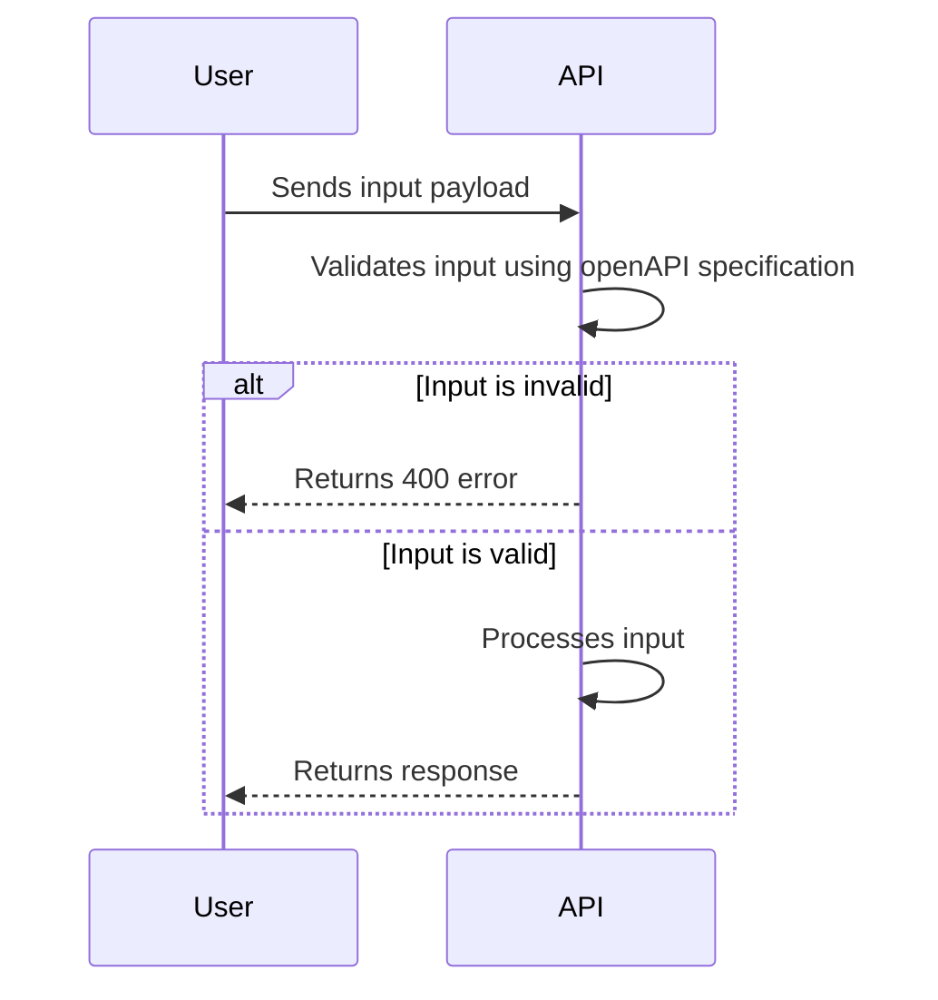
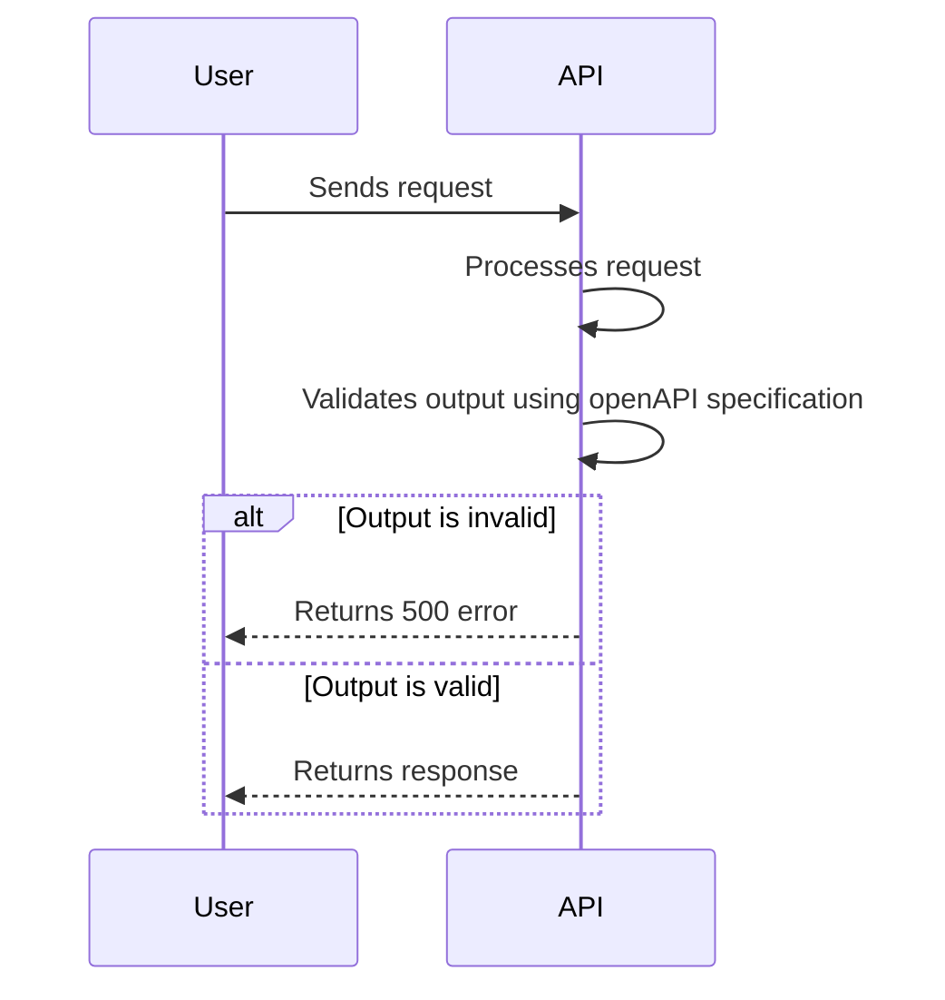

# Design-first API

## Introduction

### Design first

The design-first approach for APIs involves creating a detailed API specification (eg [OpenAPI 3](https://swagger.io/specification/)) before writing any code.

The OpenAPI specification becomes the single source of truth for the API.



- **Design API Contract**: Define the resources, methods, parameters, data types, and other aspects of the API using a tool like OpenAPI, Swagger, or RAML.

- **Generate API Specification**: Create a machine-readable document that describes the API's endpoints, input and output parameters, request and response formats, and other details from the API contract.

- **Mock API**: Simulate the behavior of the real API without performing any operations. This allows client applications to be developed in parallel with the API implementation.

- **Develop Client Applications**: Create software components that use the API to access its functionality using the API specification and mock API.

- **Implement API**: Write server-side code that conforms to the API specification using a programming language, framework, or platform.

- **Test API**: Validate the API's endpoints, input and output parameters, error handling, security, and other aspects of its behavior through manual or automated testing.

- **Deploy API**: Set up the necessary infrastructure, configure the API, and make it available to clients. Monitor and maintain the API over time to ensure its reliability and performance.

## Getting Started

### Prerequisites

Volta is used to manage the Node.js version. Install it from [here](https://volta.sh/).

### Install dependencies

```sh
npm install
```

### Build

```sh
npm run build
```

> This will:
>
> - Validate the OpenAPI specification (linting)
> - Generate the typescript types from the OpenAPI specification
> - Compile the typescript source code for the API

### Run the api

```sh
npm start:api
```

You can now access the API documentation on http://localhost:8080/docs.

### Use the project

#### Create a new package

```sh
npm init -w <package-name>
```

#### Add a dependency to a package

```sh
npm install <dependency-name> -w <package-name>
```

Then, refresh the dependencies in the root package:

```sh
npm install
```

#### Create a dependency between packages

> TODO: Maybe something better exists?

In the dependent package's `package.json`, add:

```json
"dependencies": {
  "<dependence-package-name>": "*"
}
```

The `<dependence-package-name>` being the name of the package you want to depend on (use the `name` field of the dependence's `package.json`).

Also update the `tsconfig.base.json` file by adding the path to the dependence package in the `paths` field in `compilerOptions`:

```json
"paths": {
  "<dependence-package-name>": ["<relative-path-to-dependence-package>"]
}
```

## More infos

Typescript types/interfaces are generated from the OpenAPI specification using [swagger-typescript-api](https://www.npmjs.com/package/swagger-typescript-api). These types are used in the API implementation as a development aid. They are not used at runtime.

However, [fastify-openapi-glue](https://www.npmjs.com/package/fastify-openapi-glue) is used to validate the request and response payloads against the OpenAPI specification at runtime.

For the inputs (the request payloads the user sends to the API):



> This is done automatically by fastify-openapi-glue. No additional code is required.

And for the outputs (the response payloads the API sends to the user):



> This is done automatically by fastify-openapi-glue. No additional code is required.

> This is purely a development aid and a debugging tool. It is not a security feature. The business logic of the API must validate what it produces.

IMO, This solution gives us the best of both worlds: a typed API implementation and runtime validation of the request and response payloads against a predefined OpenAPI specification.
